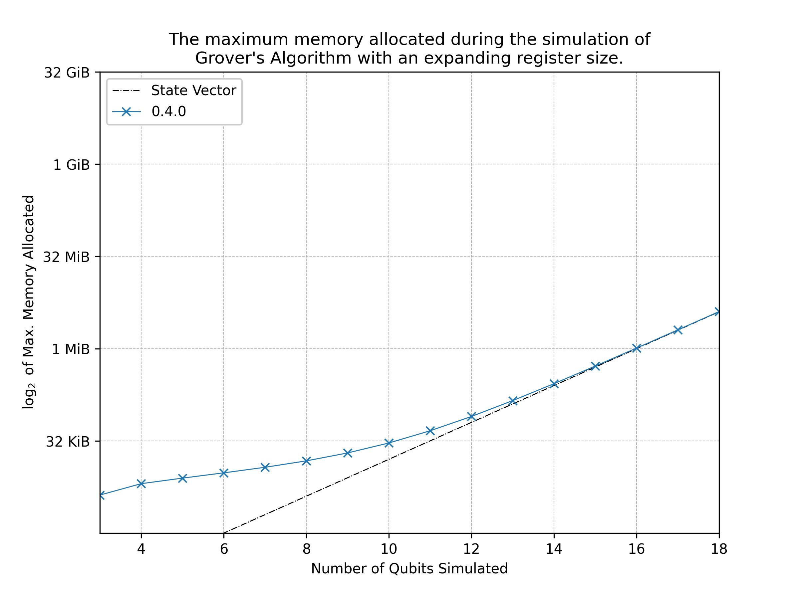

# Performance of Quantr 0.4.0

The main optimisation goal for quantr is to minimise the size of the
memory allocation required for simulating circuits. Naturally, quantum
circuit simulators will have an inherent limitation due to the
exponentially increasing size of the complex state vector that grows
with the number of qubits. Therefore, this optimisation goal is
accomplished by minimising the overhead required to evolve the state
vector.

The challenge is made more difficult by developing this library for the
use of personal machines, such as laptops and desktops that may only
have around 8GB of memory. Assuming that the optimum memory allocation
of a `n` qubit array with `f64` complex amplitudes requires `2**(n-6)
KiB` in Rust, then a primarily calculation states that these target
machines can only ever simulate circuits of up to 28 qubits (requires
4GB of memory for the state vector). Moreover, the circuit simulation
itself should remain tractable.  

With the memory requirements being the main concern, it was chosen to
develop quantr without the use of any matrix or linear algebra libraries
to represent the unitary gates. Instead, the linear mappings of these
gates in the computational basis are explicitly given using functions.
Using these maps also allows for easier extrapolation to greater qubit
circuits than using (sparse) matrices. For instance, with matrices one
may use the tensor product to calculate a single qubit gate acting in a
greater tenor space. By only using linear mappings, the states of
concern within the tensor space can be extracted and mapped directly. More
detail of how quantr works without matrices will be given in a future
update of this book.

## Memory

As of quantr-0.4.0, the minimisation of the overhead required to
simulate a state vector has been mainly accomplished. 

This was tested by using the [cap](https://crates.io/crates/cap) crate
to find the total memory allocated over the simulation of grover's
algorithm with an increasing register size. The results of which are
shown in the figure below:

 

The graph shows that quantr is seemingly successful in achieving its memory
optimisation goals: the memory allocated for the simulation converges on
the memory required to hold the state vector. 

The overhead required to run the circuit can be seen for low qubit
simulations. Even though this overhead is near double the size of the
state vector, the total memory is less than 1 MiB and is deemed small
enough to be of little concern to any personal machine.

The simulation of grovers with more than 18 qubits starts to become
intractable. There are a number of optimisations that are still planned
to be implemented for future releases of 0.4.x, and hopefully in these
releases, tests of up to 28 qubits will become tractable.

More rigorous testing would be required to definitively check that
quantr has successfully achieved its memory optimisation goals. One test
could include randomising the placement of universal gates within a
circuit of fixed qubit size, and then record the average memory
consumption of these circuits. Then the register could be increased and
the average measurement can be taken again. However, I believe the
memory required would not differ too much, and the initial testing above
gives a good indication to quantr's performance. 

The code that produced the data can be found in the [appendix](#appendix).

## Speed

The speed of quantr has been untested, and as of quantr-0.4.0, has not
been optimised in this respect. Only after further releases will this
crate be tested for speed.

## Appendix

Code for obtaining the data in the plot found in the [memory section](#memory):

```rust, ignore
use std::alloc;
use cap::Cap;
use quantr::{Circuit, Printer, Gate, QuantrError, states::*};
use std::fs::File;
use std::io::prelude::*;
use std::ops::Div;

#[global_allocator]
static ALLOCATOR: Cap<alloc::System> = Cap::new(alloc::System, usize::max_value());

fn cnot_expand(input_state: ProductState) -> Option<SuperPosition> {
    let register_size = input_state.num_qubits();

    let repeated_one: Vec<Qubit> = vec![Qubit::One; register_size];
    let mut repeated_zero: Vec<Qubit> = repeated_one.clone();
    repeated_zero[register_size-1] = Qubit::Zero;

    if input_state.get_qubits() == repeated_zero {
        Some(SuperPosition::from(ProductState::new(repeated_one.as_slice()).unwrap()))
    } else if input_state.get_qubits() == repeated_one {
        Some(SuperPosition::from(ProductState::new(repeated_zero.as_slice()).unwrap()))
    } else {
        None
    }
}


fn main() -> Result<(), QuantrError>{
    ALLOCATOR.set_limit(usize::max_value()).unwrap();
    let mut file = File::create("quantr-data-plot.txt").unwrap();
    file.write_all("0.4.0\n".as_bytes()).unwrap();

    // Grover's algorithm
    for n in 3..=18 {
        let mut qc: Circuit = Circuit::new(n)?;
    
        let sub_wire_vec: Vec<usize> = Vec::from_iter(0..n-1);

        let all_wire_vec: Vec<usize> = Vec::from_iter(0..n);
        qc.add_repeating_gate(Gate::H, all_wire_vec.as_slice())?
            .add_gate(Gate::CZ(1), 0)?
            .add_repeating_gate(Gate::H, all_wire_vec.as_slice())?
            .add_repeating_gate(Gate::X, all_wire_vec.as_slice())?
            .add_gate(Gate::H, n-1)?
            .add_gate(Gate::Custom(cnot_expand, sub_wire_vec.as_slice(), "X".to_string()), n-1)?
            .add_gate(Gate::H, n-1)?
            .add_repeating_gate(Gate::X, all_wire_vec.as_slice())?
            .add_repeating_gate(Gate::H, all_wire_vec.as_slice())?;

        let mut printer = Printer::new(&qc);
        printer.get_diagram();

        qc.toggle_simulation_progress();

        qc.simulate();

        let memory_used = (ALLOCATOR.allocated() as f32).div(1024f32);
        
        let data_line = format!("{} {}\n", n, memory_used);
        file.write_all(data_line.as_bytes()).unwrap();

        println!("Printed {}", n);
    }

    Ok(())
}
```


